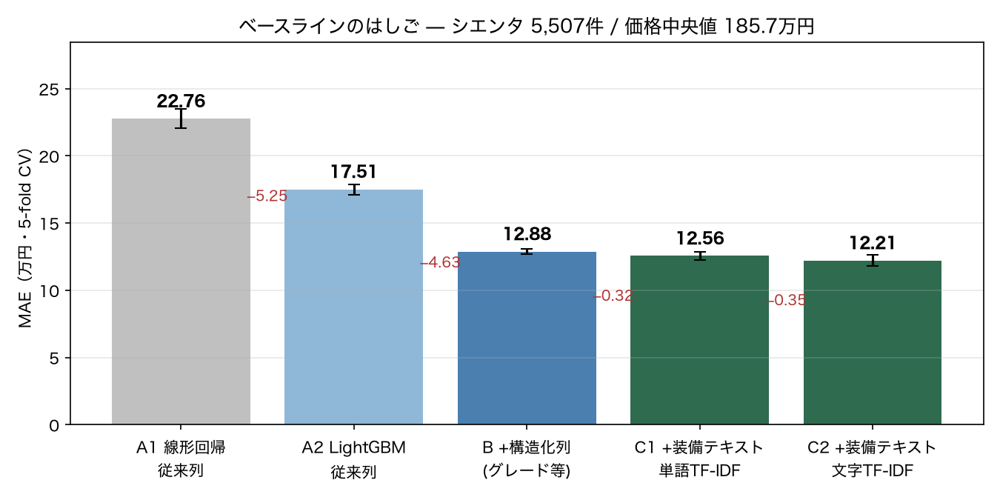
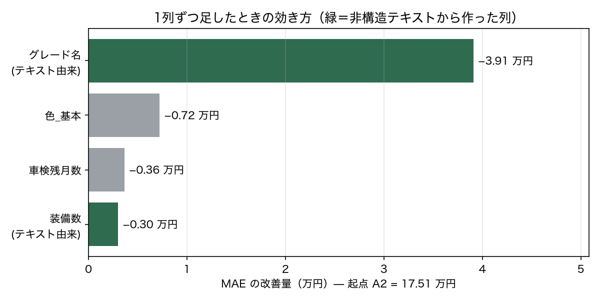

# ベースライン測定 — シエンタ 5,507件（2026-08-29）

unfold（機能A: Feature / 機能B: LLMPredictor）が超えるべき線を引くための測定。
再現: `.venv/bin/python scripts/run_baselines.py && .venv/bin/python scripts/run_ablation.py`

## 評価プロトコル（固定）

| 項目 | 値 | 理由 |
|---|---|---|
| データ | `usedsienta_clean.parquet` 5,507行 | 価格欠損（「応談」）6行のみ除外 |
| 目的変数 | `車両本体価格_万円` | 支払総額は店舗ごとの諸費用が混ざる |
| 分割 | KFold(5, shuffle, seed=42) | 内容重複は4件のみでリークの心配は小さい |
| 主指標 | MAE（万円） | 中央値185.7万円に対し外れ値が穏やか。「平均で何万円ずれるか」と読める |
| 記録先 | `results/leaderboard.csv` | 以降の全実験を追記していく |

前処理（TF-IDF等）は必ず fold 内の train だけで fit する。

## 結果

| # | 構成 | MAE | MAPE | R² | 前段からの差 |
|---|---|---:|---:|---:|---:|
| 0 | 中央値（予測しない） | 64.57 | 43.7% | −0.02 | — |
| A1 | 線形回帰・従来列 | 22.76 | 16.3% | 0.770 | −41.81 |
| A2 | LightGBM・従来列 | 17.51 | 10.9% | 0.907 | −5.25 |
| B | LightGBM・構造化列フル | 12.88 | 8.4% | 0.949 | −4.63 |
| C1 | B + 装備テキスト（単語TF-IDF） | 12.56 | 8.2% | 0.950 | −0.32 |
| C2 | B + 装備テキスト（文字TF-IDF） | **12.21** | 8.0% | 0.953 | −0.35 |
| C1' | C1 の log(価格) 版 | 12.57 | 8.0% | 0.950 | ±0 |

「従来列」＝スクレイピング当時の回帰分析と同じ構成（走行距離・車齢・修復歴・保証・
ハイブリッド・車検区分・都道府県）。

## B の伸びの分解

B で足した4列を1列ずつ入れ直した（起点は A2 = 17.51）。

| 足した列 | MAE | 改善 | 出どころ |
|---|---:|---:|---|
| グレード名 | 13.60 | **−3.91** | タイトル文字列から正規表現で抽出 |
| 色_基本 | 16.79 | −0.72 | 構造化列 |
| 車検残月数 | 17.15 | −0.36 | 構造化列 |
| 装備数 | 17.21 | −0.30 | タイトル文字列から抽出 |

## わかったこと

**1. 従来手法の限界は MAE 22.76 万円。木に替えるだけで 17.51 まで縮む。**
線形回帰の弱さは定性情報の扱い以前に、非線形性（走行距離と価格の関係）と
交互作用を表現できない点にあった。fold4 では RMSE が 56.73 に跳ねており、
one-hot した都道府県の係数が外挿で暴れている。

**2. 効いたのは「非構造テキストから構造を取り出すこと」で、−3.91 万円。**
グレード名（G / Z / G クエロ …116水準）1列で B の伸びの85%を説明する。
これはタイトル文字列から正規表現で抜いた列で、**unfold 機能A が自動化しようと
している作業そのもの**。その価値が実データで −3.91 万円と定量化できた。

**3. しかし「装備の羅列」からの上積みは −0.67 万円しかない。**
TF-IDF（単語・文字の両方）を1300次元足しても、この程度しか動かない。
装備情報の多くはグレード名に織り込み済みで、独立した情報が薄いため。

## unfold への含意（月曜の論点）

- **機能A が超えるべき線は MAE 12.21。** 上積みの余地は現状 0.67 万円分しか
  見えていない。「LLM で装備テキストを特徴量化する」だけでは差が出にくい。
- **狙うべきはグレード抽出の側。** ただしシエンタ単一車種では正規表現で足りてしまう。
  **複数車種に広げると表記が破綻して正規表現が書けなくなる** ので、
  そこが LLM の出番になる。検証するならデータを複数車種に広げる必要がある。
- **教師ラベルの起点が無い。** 仕様書は「200 labeled examples you already have」を
  前提にするが、中古車データに「テキスト→カテゴリ」の正解は存在しない。
  LLM にシードを作らせて埋め込み分類器に配る起動手順が要る。
- **指標が2階層になる。** 仕様書のデモ指標は中間ラベルの accuracy だが、
  本プロジェクトの最終指標は価格の MAE。中間ラベルが正確でも価格が当たるとは
  限らないので、特徴量の質は下流の MAE で測るべき（正解ラベル不要という利点もある）。
- **画像モダリティは今のデータでは検証できない。** `画像URL` 列は lazy-load の
  プレースホルダ（`animation_S.gif`）しか取れていない。詳細ページURLはあるので
  再取得は可能。あるいは `vehicles.csv` の `image_url`（9割充足）を使う。
- **機能B は分類前提（`resale_band` / `churn` で `predict_proba`）。**
  中古車価格は連続値なので、バンドに切るのか回帰にするのかの確認が要る。

## 未着手・ブロッカー

- **埋め込み（機能A の 02〜04）が回せない。** ローカル埋め込みには torch が要るが、
  このマシン（Intel Mac）では torch 2.2.2 が上限で、現行の numpy 2.5.2 と非互換。
  主環境を壊さずにやるなら別 venv で埋め込みだけ先に計算して parquet に落とす形になる。
  API 経由（Voyage / OpenAI）なら導入は1行だが、**APIキーが未設定**。
- **LLM フォールバック（05）も APIキー待ち。**
