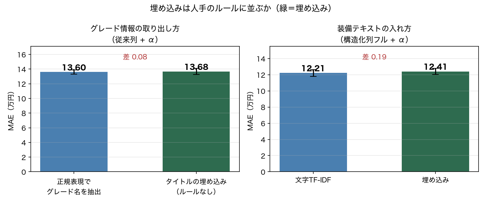

# ベースライン測定 — シエンタ 5,507件（2026-08-29）

unfold（機能A: Feature / 機能B: LLMPredictor）が超えるべき線を引くための測定。
再現: `.venv/bin/python scripts/run_baselines.py && .venv/bin/python scripts/run_ablation.py`

## 評価プロトコル（固定）

| 項目 | 値 | 理由 |
|---|---|---|
| データ | `usedsienta_clean.parquet` 5,507行 | 価格欠損（「応談」）6行のみ除外 |
| 目的変数 | `車両本体価格_万円` | 支払総額は店舗ごとの諸費用が混ざる |
| 分割 | KFold(5, shuffle, seed=42) | 内容重複は4件のみでリークの心配は小さい |
| 主指標 | MAE（万円） | 中央値185.7万円に対し外れ値が穏やか。「平均で何万円ずれるか」と読める |
| 記録先 | `results/leaderboard.csv` | 以降の全実験を追記していく |

前処理（TF-IDF等）は必ず fold 内の train だけで fit する。

## 結果


| # | 構成 | MAE | MAPE | R² | 前段からの差 |
|---|---|---:|---:|---:|---:|
| 0 | 中央値（予測しない） | 64.57 | 43.7% | −0.02 | — |
| A1 | 線形回帰・従来列 | 22.76 | 16.3% | 0.770 | −41.81 |
| A2 | LightGBM・従来列 | 17.51 | 10.9% | 0.907 | −5.25 |
| B | LightGBM・構造化列フル | 12.88 | 8.4% | 0.949 | −4.63 |
| C1 | B + 装備テキスト（単語TF-IDF） | 12.56 | 8.2% | 0.950 | −0.32 |
| C2 | B + 装備テキスト（文字TF-IDF） | **12.21** | 8.0% | 0.953 | −0.35 |
| C1' | C1 の log(価格) 版 | 12.57 | 8.0% | 0.950 | ±0 |

「従来列」＝スクレイピング当時の回帰分析と同じ構成（走行距離・車齢・修復歴・保証・
ハイブリッド・車検区分・都道府県）。

## B の伸びの分解

B で足した4列を1列ずつ入れ直した（起点は A2 = 17.51）。


| 足した列 | MAE | 改善 | 出どころ |
|---|---:|---:|---|
| グレード名 | 13.60 | **−3.91** | タイトル文字列から正規表現で抽出 |
| 色_基本 | 16.79 | −0.72 | 構造化列 |
| 車検残月数 | 17.15 | −0.36 | 構造化列 |
| 装備数 | 17.21 | −0.30 | タイトル文字列から抽出 |

## わかったこと

**1. 従来手法の限界は MAE 22.76 万円。木に替えるだけで 17.51 まで縮む。**
線形回帰の弱さは定性情報の扱い以前に、非線形性（走行距離と価格の関係）と
交互作用を表現できない点にあった。fold4 では RMSE が 56.73 に跳ねており、
one-hot した都道府県の係数が外挿で暴れている。

**2. 効いたのは「非構造テキストから構造を取り出すこと」で、−3.91 万円。**
グレード名（G / Z / G クエロ …116水準）1列で B の伸びの85%を説明する。
これはタイトル文字列から正規表現で抜いた列で、**unfold 機能A が自動化しようと
している作業そのもの**。その価値が実データで −3.91 万円と定量化できた。

**3. しかし「装備の羅列」からの上積みは −0.67 万円しかない。**
TF-IDF（単語・文字の両方）を1300次元足しても、この程度しか動かない。
装備情報の多くはグレード名に織り込み済みで、独立した情報が薄いため。

## unfold への含意（月曜の論点）

- **機能A が超えるべき線は MAE 12.21。** 上積みの余地は現状 0.67 万円分しか
  見えていない。「LLM で装備テキストを特徴量化する」だけでは差が出にくい。
- **狙うべきはグレード抽出の側。** ただしシエンタ単一車種では正規表現で足りてしまう。
  **複数車種に広げると表記が破綻して正規表現が書けなくなる** ので、
  そこが LLM の出番になる。検証するならデータを複数車種に広げる必要がある。
- **教師ラベルの起点が無い。** 仕様書は「200 labeled examples you already have」を
  前提にするが、中古車データに「テキスト→カテゴリ」の正解は存在しない。
  LLM にシードを作らせて埋め込み分類器に配る起動手順が要る。
- **指標が2階層になる。** 仕様書のデモ指標は中間ラベルの accuracy だが、
  本プロジェクトの最終指標は価格の MAE。中間ラベルが正確でも価格が当たるとは
  限らないので、特徴量の質は下流の MAE で測るべき（正解ラベル不要という利点もある）。
- **画像モダリティは今のデータでは検証できない。** `画像URL` 列は lazy-load の
  プレースホルダ（`animation_S.gif`）しか取れていない。詳細ページURLはあるので
  再取得は可能。あるいは `vehicles.csv` の `image_url`（9割充足）を使う。
- **機能B は分類前提（`resale_band` / `churn` で `predict_proba`）。**
  中古車価格は連続値なので、バンドに切るのか回帰にするのかの確認が要る。

## 追記：埋め込みを試した（同日）

隔離環境で埋め込みを計算して測り直した。手順は
`bash scripts/setup_embed_env.sh` → `.venv-embed/bin/python scripts/embed_text.py`
→ `.venv/bin/python scripts/run_embedding.py`。

主環境（numpy 2.x）に torch を入れると壊れるので、`.venv-embed`（numpy 1.26 + torch 2.2.2）
で埋め込みだけ計算し、parquet 経由で受け渡している。モデルは
`intfloat/multilingual-e5-small`（多言語384次元）。CPU のみで 5,513件 × 2列に約16分。

問いは2つ。

| 問い | 比較 | 結果 |
|---|---|---|
| **正規表現なしでグレード情報を取れるか** | Ab1（正規表現でグレード名抽出）13.60 vs **D2（タイトル埋め込みのみ）13.68** | **ほぼ同等（差0.08、標準偏差±0.42の範囲内）** |
| 埋め込みは TF-IDF に勝つか | C2（文字TF-IDF）12.21 vs D1（埋め込み）12.41 | **TF-IDF の方がわずかに良い** |



| 手法 | MAE | 備考 |
|---|---:|---|
| D3 構造化列フル + タイトル埋め込み（全部乗せ） | 12.38 | C2 に届かず |
| D1 B + 装備テキスト埋め込み | 12.41 | TF-IDF の 12.21 に届かず |
| **D2 従来列 + タイトル埋め込み（グレード名なし）** | **13.68** | 正規表現版 13.60 とほぼ同等 |
| D2b D2 の PCA 64次元版 | 13.70 | 次元圧縮の効果なし |

### わかったこと

**1. 埋め込みは、人手で書いた正規表現と同等の情報を取り出せた。**
D2 は `グレード名` の列を一切使わず、タイトルの生文字列を埋め込んだだけで
MAE 13.68。正規表現で抜いた Ab1 の 13.60 と実質同じ。
A2（17.51）からの改善幅で言えば **−3.83 対 −3.91** でほぼ一致する。
**unfold 機能A の中核的な前提（非構造テキストから人手のルールなしに特徴量を作れる）が、
実データで裏付けられた。**

**2. ただし、既存のベースラインは超えられない。** 最良は依然 C2 の 12.21。
埋め込みを足した全部乗せ（D3）でも 12.38 で届かない。
シエンタ単一車種では、正規表現が完璧に機能してしまうので**置き換える動機がない**。
価値が出るのは正規表現が破綻する場面、すなわち複数車種への拡張時。

**3. 近傍検索が「価格の近さ」を拾うとは限らない（機能B への指摘）。**
タイトル埋め込みで最も近い車を引く定性確認をしたところ、こういう例が出た。

```
■ 基準: G  130.1万円  9年  89,000km
   シエンタ ハイブリッド 1.5 G /沖縄県/ガリバーuruma店
   └ 類似0.965  G  156.2万円  シエンタ ハイブリッド 1.5 G /埼玉県/ガリバー新狭山店
   └ 類似0.964  G  264.6万円  シエンタ ハイブリッド 1.5 G /静岡県/ガリバー藤枝南新屋店
   └ 類似0.961  G  176.0万円  シエンタ ハイブリッド 1.5 G /山梨県/ガリバー富士吉田店
```

類似度0.96以上で引かれた3台の価格が 156 / 265 / 176 万円とばらばら。
この店（ガリバー）はタイトルに装備を書かず店舗名だけを書く形式なので、
**埋め込みが「店舗名の書式が同じ」ことに反応している**。年式も走行距離も文字列に
現れないため、価格を決める情報がほとんど入っていない。

原因はコサイン類似度の性質にある。グレード別に400組ずつサンプリングして
平均類似度を測ると、**同一グレード同士 0.915〜0.928 に対し、異なるグレード同士 0.909〜0.915**
とほとんど差がない。タイトルの文字数の大半は全車共通の部分と装備の羅列で、
グレードはたった1文字。**文章全体の向きを見るコサイン類似度では、その1文字が埋もれる。**

D2 が成功したのは、LightGBM が384次元を1つずつ扱えるからである。
**同じ埋め込みでも、近傍検索に使うと同じようには機能しない。**

- 教師あり学習 … 価格と関係のある次元を選べる。埋もれた情報も取り出せる
- 近傍検索 … 384次元をまとめて1つの距離にする。埋もれた情報は取り出せない

仕様書の機能B は `examples="semantic"` で「似た事例」を LLM に証拠として渡す設計だが、
**この「似ている」は価格の近さを意味しない。** 埋め込み類似度だけで近傍を選ぶと、
上のような無関係な事例を根拠として渡してしまう。機能A の 03「近い正解例を探す」も
同じ構造なので、同じリスクを抱える。

考えられる対策（どれを採るかは設計判断なのでミーティングで確認したい）:

- 数値列（年式・走行距離）を含めた距離にする
- 価格帯で絞り込んでから、意味的に近い順に並べる
- 埋め込みの入力からノイズ（店舗名・都道府県）を除いてから作る

## 未着手・ブロッカー

- **LLM フォールバック（機能A の 05）と機能B は APIキー待ち。** `.env` が未作成。
- **画像モダリティは今のデータでは検証できない**（前述）。
