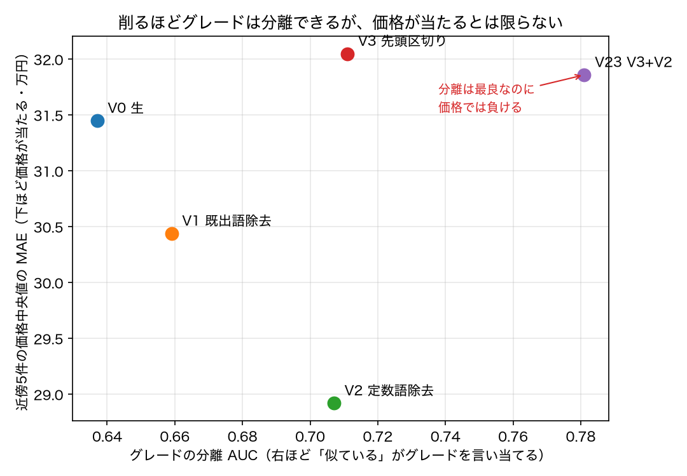
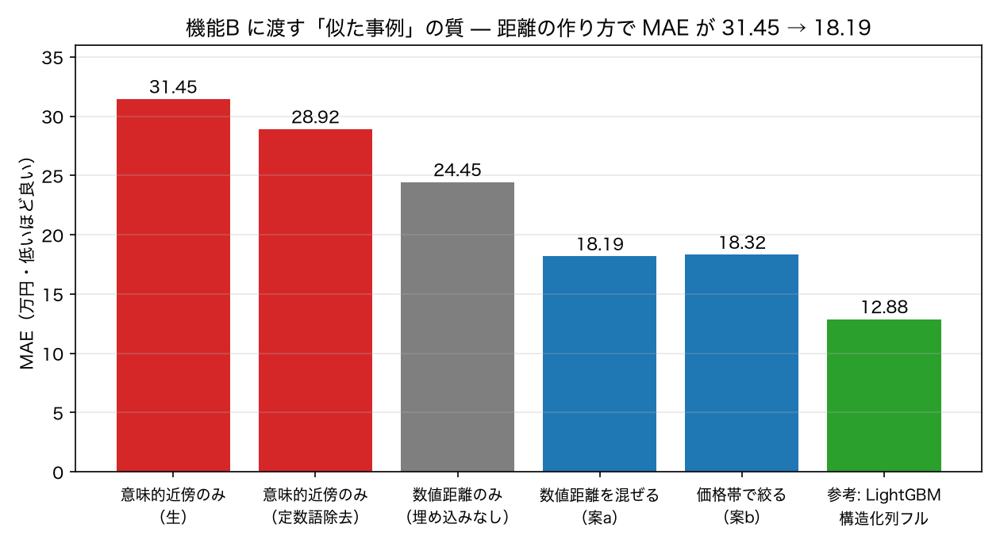

# 埋め込み前のノイズ除去と、近傍検索の作り直し（シエンタ）

**日付**: 2026-08-29
**再現**: `.venv-embed/bin/python scripts/embed_denoise.py` → `.venv/bin/python scripts/run_denoise.py` → `.venv/bin/python scripts/plot_denoise.py`
**関連**: PRD §2.2-d 反証2 / §7-2（類似事例の選び方）/ §7-3（機能A の評価軸）

## 何を確かめたかったか

前回の測定で、埋め込みの「似ている」が**価格の近さを意味していない**ことが分かった。
タイトル埋め込みで類似度 0.96 の3台を引くと価格が 156 / 265 / 176 万円とばらばらで、
グレード別に平均類似度を測っても同一グレード 0.915 対 異グレード 0.912 とほとんど差がなかった。

これは機能B の設計に直接効く。仕様書の機能B は「似た事例を証拠として LLM に渡す」形なので、
その「似ている」が価格と無関係なら、**LLM に無関係な事例を根拠として渡すことになる**。

原因はコサイン類似度（2つのベクトルの向きの一致度）が文章全体の向きを見ることにある。
タイトルは大半が全車共通の語と装備の羅列で、価格を決めるグレード名はたった1文字。
その1文字が埋もれる。そこで**入力テキストを削れば直るのか**を測った。

## 用意した4つの版

削り方はすべて**車種に依存しない汎用ルール**にした。「シエンタのグレードは G/Z/X」のような
車種固有の知識を書いた時点で、人手のルールを排するという機能A の趣旨が崩れるため。
実装は `scripts/text_variants.py`。

| 版 | 何をするか | 平均文字数 |
|---|---|---:|
| V0 生 | 何もしない（現状） | 81.2 |
| V1 既出語の除去 | 店舗名・都道府県・車名など、**すでに別の構造化列に入っている値**をテキストから消す | 76.1 |
| V2 定数語の除去 | コーパス内の出現率が 90% 以上のトークンを消す。今回消えたのは「シエンタ」「1.5」の2語だけで、**人がリストを書いたのではなくデータから決まった** | 72.1 |
| V3 先頭区切りまで | 「モデル名 … 装備の羅列」という構造を仮定し、最初の区切り（全角スペース・`/`）で切る | 27.8 |
| V23 | V3 と V2 の併用 | 23.9 |

V3 では `シエンタ ハイブリッド 1.5 G /沖縄県/ガリバーuruma店` が `ハイブリッド 1.5 G` になる。

## 結果1: ノイズを削るとグレードは分離できるようになる

ランダムに20万ペア引き、同一グレード同士と異グレード同士で類似度を比べた。
平均の差は文の長さに引きずられるので、順位で見る **AUC**（同一グレードのペアの方が
類似度が高い確率。0.5 = まったく区別できない、1.0 = 完全に分離）を主に見る。

| 版 | 同一グレード | 異グレード | 差 | AUC |
|---|---:|---:|---:|---:|
| V0 生 | 0.9221 | 0.9106 | +0.0115 | 0.637 |
| V1 既出語の除去 | 0.9076 | 0.8918 | +0.0158 | 0.659 |
| V2 定数語の除去 | 0.9009 | 0.8761 | +0.0247 | 0.707 |
| V3 先頭区切りまで | 0.9148 | 0.8938 | +0.0210 | 0.711 |
| **V23 V3+定数語除去** | 0.8985 | 0.8653 | **+0.0331** | **0.781** |

**削るほど分離は良くなる**（AUC 0.637 → 0.781）。定数語を2語消すだけでも 0.637 → 0.707 動く。
埋め込みモデルを替えたわけでも学習をしたわけでもなく、**入力から情報のない語を抜いただけ**である。

## 結果2: しかし分離の改善は、価格予測の改善と一致しない【重要】

近傍が本当に証拠として使えるかを、他の実験と同じ物差しで測る。
テスト行ごとに訓練データから意味的に近い5件を引き、**その5件の価格の中央値を予測値**とした。
5-fold 交差検証に載せてあるので、下の MAE（平均絶対誤差。予測が平均で何万円ずれるか）は
これまでの全手法と直接比較できる。

| 版 | グレード分離 AUC | 近傍5件の価格中央値 MAE |
|---|---:|---:|
| V0 生 | 0.637 | 31.45（±0.83） |
| V1 既出語の除去 | 0.659 | 30.44（±0.69） |
| **V2 定数語の除去** | 0.707 | **28.92（±0.77）** |
| V3 先頭区切りまで | 0.711 | 32.05（±1.17） |
| V23 V3+定数語除去 | **0.781** | 31.86（±0.74） |

**分離が最良の V23 が、価格では V2 に 2.9 万円負けている。**
順位が入れ替わっており、AUC と MAE は同じ方向を向いていない。

理由は、V3 系が装備の羅列ごと捨てているため。グレード名は価格の一部でしかなく、
「純正ナビ」「両側電動スライドドア」「ワンオーナー」といった記述にも価格の情報が乗っている。
**グレードを当てる能力を上げる削り方と、価格を当てる能力を上げる削り方は別物だった。**

これは PRD §7-3（機能A の評価は中間ラベルの accuracy で見るか、下流の MAE で見るか）に
そのまま効く実測である。**中間ラベルの精度を上げにいくと、下流の精度を落としうる。**
本プロジェクトが下流 MAE を評価軸に置いている立場は、この結果に支持されている。

## 結果3: 意味的な近さだけでは証拠にならない。距離の作り方の方が効く

PRD §7-2 に挙げた対策案を2つとも実装して測った。比較の基準として、
予測をしない場合（中央値）と統計モデルの実測値を並べる。

| 近傍の選び方 | MAE（万円） | 生の意味的近傍からの改善 |
|---|---:|---:|
| （参考）中央値を答える＝予測しない | 64.57 | — |
| 意味的近傍のみ V0 生 | 31.45 | — |
| 意味的近傍のみ V2 定数語除去 | 28.92 | −2.53 |
| **数値距離のみ（埋め込みを使わない）** | **24.45** | −7.00 |
| 対策a 距離に車齢・走行距離を混ぜる（V0・w=0.15） | 19.19 | −12.26 |
| **対策a 同（V2・w=0.15）** | **18.19** | **−13.26** |
| 対策b 粗い予測の価格帯 ±20% に絞ってから意味的に選ぶ（V0） | 18.32 | −13.13 |
| 対策b 同（V23） | 18.36 | −13.09 |
| （参考）LightGBM・構造化列フル | 12.88 | — |
| （参考）現在の最良 C2 | 12.21 | — |

読み取れることは3つある。

**1. 意味的な近さ「だけ」で近傍を選ぶのは、機能B の証拠として弱い。**
最良でも 28.92 で、統計モデル（12.88）の 2.2 倍ずれる。仕様書の `examples="semantic"` を
そのまま実装すると、この質の事例が LLM に渡る。

**2. 対策は両方とも効き、効き方はほぼ同じ（18.2〜18.4）。**
距離に車齢・走行距離を混ぜても、粗い予測で価格帯を絞ってから意味的に並べても、
到達点は変わらなかった。**実装が単純な方（対策a）を既定にしてよい**と言える。
なお混ぜる重み w は 0.05 で 19.13、0.15 で 18.46、0.3 で 18.81 と 0.15 付近が底で、
極端に敏感ではない。

**3. それでも埋め込みは寄与している。**
数値距離だけで近傍を引くと 24.45。そこに埋め込みを足すと 18.19 まで下がる（−6.3 万円）。
**「意味的な近さは無価値」ではなく、「単独では使えない」が正しい。**

ただし対策後の 18.19 でも、統計モデルの 12.21 には 6 万円届かない。
**近傍事例は、統計モデルの予測値ほど強い証拠ではない。**
機能B に渡す証拠の主役は統計モデルの予測値で、近傍事例は補助、という順序づけが実測から支持される。

## 結果4: 副作用の確認 — 削りすぎると教師あり学習の精度は落ちる

ノイズ除去はテキストを削る操作なので、消しすぎれば情報も落ちる。
LightGBM に埋め込みを渡した構成（グレード名の列は使わない＝ D2 相当）で確認した。

| 版 | MAE（万円） | 生からの差 |
|---|---:|---:|
| V0 生 | 13.68（±0.42） | — |
| V1 既出語の除去 | 13.68（±0.34） | ±0.00 |
| **V2 定数語の除去** | **13.29（±0.31）** | **−0.39** |
| V3 先頭区切りまで | 13.79（±0.33） | +0.11 |
| V23 V3+定数語除去 | 13.58（±0.30） | −0.10 |

**V2 だけが両方（近傍 −2.53・教師あり −0.39）を改善した。**
V3 系は近傍でも教師ありでも生に負けており、削りすぎである。

## 結論 — 機能A・機能B に持ち帰るもの

1. **定数語の除去（V2）は機能A の前処理の既定にしてよい。**
   出現率が閾値以上のトークンを落とすだけで、人がリストを書く必要がない。
   下流精度・近傍の質・埋め込みの計算時間（削ると 3 倍速い。V1 約600秒 対 V3 218秒）の
   3つとも改善するか悪化しない。
2. **先頭区切りで切る（V3）は採らない。** グレード分離だけは最も良くなるが、
   価格に効く装備情報を巻き添えにする。
3. **機能B の `examples="semantic"` は、意味的類似度だけで実装してはいけない。**
   距離に数値列を混ぜる（対策a）を既定にする。MAE 28.92 → 18.19。
4. **機能A の評価は中間ラベルの精度で代用できない。** AUC と MAE で版の順位が入れ替わる。

## この前処理は Craigslist には効かない（測る前に判明）

同じ3ルールを複数車種データにも当てるつもりで先に調べたところ、`model` 列は
**平均 9.9 文字ですでに短く**、区切り記号を含む行が 0.7%、メーカー名を含む行が 0.6% しかなかった。
削る対象がほぼ存在しないため、埋め込みを作り直しても MAE は動かない。
**ノイズ除去が効くかどうかは列の書式しだい**であり、カーセンサーのタイトルのように
「モデル名＋装備の羅列」が1列に詰まっている形式でこそ効く。
スクリプトは `scripts/embed_denoise_vehicles.py` に用意してあるが、実行していない。
