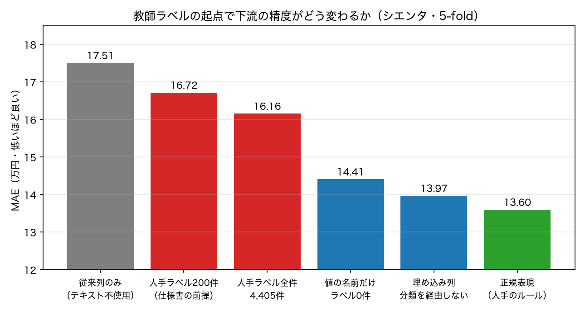
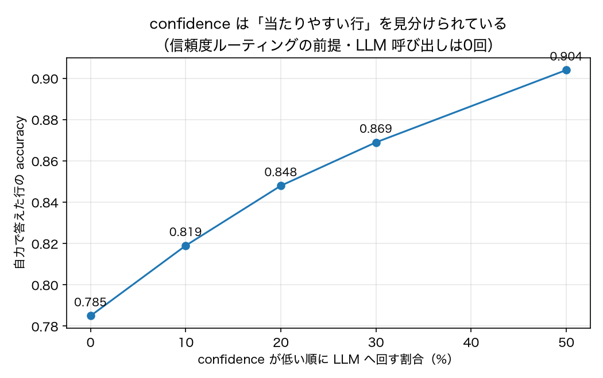

# 機能A（`Feature`）の骨組みと、教師ラベルの起点3案の実測

**日付**: 2026-08-29
**実装**: `unfold/`（`feature.py` / `encoders.py` / `preprocess.py` / `fallback.py`）
**テスト**: `.venv/bin/python -m pytest tests -q`（22件）
**再現**: `.venv/bin/python scripts/demo_feature.py` → `.venv/bin/python scripts/plot_feature.py`
**関連**: PRD §7-1（教師ラベルの起点）/ §7-3（機能A の評価軸）/ 月曜アジェンダ B-3

## 何を作ったか

設計書（`dialogs/unfold-landing.html`）の機能A を、**LLM 呼び出しなしで動くところまで**実装した。
設計書の「What runs per row」01〜05 のうち、LLM が出てくるのは 05 だけなので、
APIキーが未確定でも 01〜04 は作れて測れる、という切り分けである。

| 段階 | 設計書 | 実装状況 |
|---|---|---|
| 01 | 手元の正解ラベル | **3つの入口を用意**（下記）。どれも選ばなければ例外で止める |
| 02 | 埋め込み（キャッシュ付き） | `CachedEncoder`。同じ文字列は二度計算しない |
| 03 | 近傍の類似度とラベル一致度 → confidence | 実装。confidence の定義は測定の結果1度作り直した（後述） |
| 04 | 確信なら即返す（LLM 呼ばず） | 実装 |
| 05 | 確信がなければ LLM へ | **差し込み口だけ。**既定は答えずキューに積む `QueueOnlyFallback` |

検査 API（`explain` / `confidence` / `examples` / `cost` / `status` / `review_queue`）も設計書どおり用意した。
`explain(i)` は1セルの来歴（値・confidence・由来・参照した事例・費用）を返す。

```python
from unfold import Feature

df["グレード"] = Feature(
    source="タイトル",
    type="category",
    values=["G", "Z", "X", "G クエロ"],
).fit_transform(df)
```

エンコーダは差し替え可能で、**既定は追加依存なしで動く文字 n-gram TF-IDF**にした。
埋め込みモデル（multilingual-e5-small）を必須にすると torch が要り、
このプロジェクトでは主環境に入れていない。実測でも文字 TF-IDF は埋め込みと同等〜わずかに上だった。

## 教師ラベルの起点 — 3案を同じ物差しで測った【B-3 の材料】

仕様書は「すでに 200 件の正解ラベルがある」前提だが、中古車データにその正解は存在しない。
そこで起点の作り方を3通り用意し、**シエンタでグレード列を正規表現なしに作り直す**課題で比べた。

- **(b) ラベル0件** … `values=[...]` に値の名前を宣言し、**その名前自体を参照事例**にする
- **(a) ラベル200件** … 仕様書の前提どおりの件数だけ人手ラベルを与える
- **(c) 埋め込み列** … 分類を経由せず、埋め込みをそのまま特徴量にする（ラベルという概念を使わない）

比較の基準は既存のベースライン。**A2（テキストを使わない）17.51 万円**と、
**Ab1（正規表現でグレード名を抜いた人手のルール）13.60 万円**の間のどこに来るかを見る。

| 起点 | 中間ラベルの accuracy | 下流の MAE（万円） | A2 からの改善 |
|---|---:|---:|---:|
| A2 従来列のみ（比較の下限） | — | 17.51 | — |
| **(b) ラベル0件・値の名前だけ** | **0.785** | **14.41** | **−3.10** |
| (a) 人手ラベル200件 | 0.555 | 16.72 | −0.79 |
| (a') 人手ラベル全件（4,405件） | 0.678 | 16.16 | −1.35 |
| **(c) 埋め込み列（ラベル不要）** | — | **13.97** | **−3.54** |
| Ab1 正規表現のグレード名（比較の上限） | 1.000 | 13.60 | −3.91 |



### 読み取れること

**1. 仕様書が前提にしている「人手ラベル200件」が、3案でいちばん弱かった。**
ラベルを1件も使わない (b) が、accuracy で +0.23、下流 MAE で 2.31 万円良い。
ラベルを全件（4,405件）与えても 16.16 で (b) に届かない。

理由は参照事例の中身にある。人手ラベルの参照テキストは**タイトル全文**なので、
近傍が「装備の羅列が似ている車」で決まってしまう。一方、値の名前を参照事例にすると
`G クエロ` という文字列そのものと照合するので、**グレードの部分だけを見ることになる**。
ラベルの件数ではなく、**参照事例が何を含んでいるか**が効いている。

**2. ただしこの優位は、データの性質に依存する。**
シエンタでは正解のグレード名がタイトルの中に文字どおり書かれている
（そもそも正解自体が正規表現でタイトルから抜いたもの）。
**「値の名前が本文にそのまま出てくる」データでしか (b) の強さは成り立たない。**
Craigslist の `model` 列のように値そのものが自由記述の場合は別途測る必要がある。

**3. 分類を経由しない (c) が最も良い。**
カテゴリ10値に丸める時点で情報が落ちる（宣言した10値で実データの 88.1% しかカバーできず、
残りは 116 水準の裾に散る）。埋め込みをそのまま渡せば丸めが起きない。
**機能A の出力を「型のついた列」に限定すべきか**という設計上の問いがここに出る。
人が読める列が要るなら (b)、下流の精度が要るなら (c)、という使い分けになる。
これは §7-3（中間ラベルの精度で評価するか下流の MAE で評価するか）と同じ構造の話である。

**4. 人手のルール（13.60）にはまだ届かない。**
(c) で 13.97、差は 0.37 万円。ただし単一車種では正規表現が完璧に効くので、
これは想定内（Craigslist では逆に埋め込みが人手ルールに 163 USD 勝っている）。

## 信頼度ルーティングの前提を確かめた



設計書の `AdaptivePredictor` は「confidence が低い行だけ LLM に回す」ことで費用を抑える。
**これが成り立つのは confidence が実際の正しさと相関している場合だけ**なので、先に確かめた。
confidence の低い順に r% を切り捨て、残った行の accuracy を見る。

| LLM に回す割合 | 自力で答える行 | その行の accuracy（(b) の場合） |
|---:|---:|---:|
| 0% | 5,507 | 0.785 |
| 10% | 4,956 | 0.819 |
| 20% | 4,405 | 0.848 |
| 30% | 3,855 | 0.869 |
| 50% | 2,753 | 0.904 |

**単調に上がっている。**confidence は「当たりやすい行」を実際に見分けており、
信頼度ルーティングの前提は成り立つ。(a) 人手ラベル200件でも同じ傾向（0.555 → 0.686）だった。
**この確認は LLM を1回も呼ばずにできる**ので、APIキー待ちのまま P4（閾値を振って
精度・費用・レイテンシの曲線を出す）の半分は先に進められる。

## 測定して見つかった骨組みの欠陥（修正済み）

実装しただけでは気づかず、実データに通して初めて出た問題が2つあった。

**1. confidence の定義が「1クラス1件」の起点で破綻していた。**
最初は「近傍 k 件のうち何割が同じラベルか」を confidence にしていた。
これは値の名前を起点にすると必ず割れる（10クラスに1件ずつしか参照事例がないので、
k=5 なら5クラスに散る）。閾値 0.9 に対して **99.9% の行が「自信なし」**になった。
→ **1位のクラスが2位に対してどれだけ強いか**という相対比に作り直し、
さらに `k="auto"`（1クラスあたりの件数から k を決める）を入れた。

**2. 絶対的な閾値は、いまの段階では指定しづらい。**
confidence はまだ較正されていない（値の絶対水準に意味がない）。
一方で上の表のとおり**順序としては機能する**。そこで
`escalate_rate=0.1`（確信度の低い順に10%を回す）という指定方法を足した。
費用の上限が未確定（PRD §7-9）な現状では、
**「予算に収まる割合」から逆算できるこちらの方が実務的**である。

## まだ無いもの

- **05 の LLM 実装**（`LLMFallback` の差し込み口だけ。APIキー待ち）
- **機能B（`LLMPredictor`）と `AdaptivePredictor`** — 今回は機能A のみ
- `type` は category / binary / embedding のみ。int・float・ordinal・multilabel は未実装
- 画像・複数モダリティ（`source=["image", "description"]` の連結までは実装、画像は未対応）
- 来歴の永続化とバージョニング（設計書の `unfold status` にある「v12」「ground truth 1,284 locked」）
