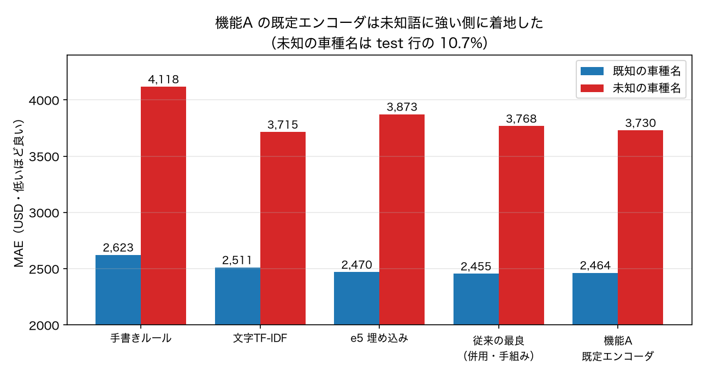

# 未知の車種名で機能A を測り直す（P2）

**日付**: 2026-08-29
**再現**: `.venv/bin/python scripts/run_unseen_feature.py` → `.venv/bin/python scripts/plot_feature.py`
**関連**: PRD §8 の P2 / §2.2-d 反証1（未知語では文字TF-IDF が埋め込みに勝つ）
**前提**: P1 の測定は `docs/2026-08-29-feature-vehicles.md`

## 何を確かめたかったか

テスト行の **10.7%（6,424行）** は、訓練データに1度も出てこない車種名を持つ。
新型車・書き方の揺れ・珍しいグレードがここに来るので、実運用そのものである。
そして既測では、この場所で手法の得意不得意がはっきり分かれていた。

- **文字 TF-IDF は未知語に強い。** `f-250 lariat` を知らなくても
  `f-2` `250` `lar` という既知の断片に分解できる
- **e5 埋め込みは既知語に強い。** 文全体を1つのベクトルにするので、
  固有名詞そのものを知らないと分解しきれない

機能A の既定エンコーダは**文字 n-gram TF-IDF を SVD で 256 次元に圧縮**したものである。
文字 n-gram を使うので未知語に強いはずだが、**256 次元に潰す過程で断片の情報が
失われている可能性がある**。潰れているなら、機能A は既定のままでは未知語に弱い。
P1 で見た全体の 2,601 は、既知語の多さに支えられているだけかもしれない。それを切り分ける。

条件は P1 と完全に同じ 60,000 行・5-fold。比較対象（B2・C2・D1・D4）は
内訳を出すために同じ df で回し直しており、**全体 MAE は既測値と一致した**
（2,783 / 2,640 / 2,620）。

## 結果

| 手法 | 全体 MAE | 既知の車種名 | 未知の車種名 |
|---|---:|---:|---:|
| B2 手書きルール | 2,783 | 2,623 | 4,118 |
| C2 文字TF-IDF | 2,640 | 2,511 | **3,715** |
| D1 e5 埋め込み | 2,620 | 2,470 | 3,873 |
| D4 e5 埋め込み＋文字TF-IDF（従来の最良） | 2,596 | 2,455 | 3,768 |
| **F(c)' 機能A・埋め込み列（既定エンコーダ）** | 2,599 | **2,464** | **3,730** |
| F(c-e5)' 機能A・埋め込み列（e5 を API 経由） | 2,621 | 2,470 | 3,886 |
| **F(d)' 機能A・埋め込み列＋文字TF-IDF** | **2,588** | **2,455** | **3,700** |

### 1. 機能A の既定エンコーダは、未知語に強い側に着地した

未知の車種名で **3,730**。e5 埋め込み（3,873）より **143 USD 良く**、
文字TF-IDF 単体（3,715）とほぼ同じ（+15）。
**SVD で 256 次元に圧縮しても、文字断片の情報は失われていない。**

### 2. しかも既知の車種名でも強い — 単一のエンコーダで両取りになっている

既知で 2,464。文字TF-IDF 単体（2,511）より 47 良く、e5 埋め込み（2,470）と同等。

これが今回いちばん重要な点である。**これまで「既知は埋め込み・未知は文字TF-IDF」という
役割分担があり、両取りするには併用（D4）が必要だった。**機能A の既定エンコーダは
1つの表現で両方に届いている（既知 2,464 対 D4 2,455、未知 3,730 対 D4 3,768）。

理由は、文字 n-gram（未知語に強い性質）を保ったまま SVD で密ベクトルにしているため。
疎な TF-IDF のままだと木が個々の n-gram を1つずつ見るしかないが、
密な 256 次元なら「似た綴りの車種が近い」という構造を軸として使える。
**未知語耐性を落とさずに、埋め込みの利点を得ている。**

### 3. 併用すると従来の最良を更新した

`F(d)'`（機能A の埋め込み列＋素の文字TF-IDF）が全体 **2,588** で、
従来の最良 D4（2,596）を 8 USD 下回った。未知語でも 3,700 で全手法中の最良。
ただし差は振れ幅（±8）と同程度なので、**「並んだ」と言うのが正確**である。

### 4. e5 を API 経由で使った場合は D1 と一致

F(c-e5)' は 2,621 / 2,470 / 3,886 で、D1（2,620 / 2,470 / 3,873）と実質同じ。
**機能A の API はエンコーダの性能をそのまま通す**（余計な劣化も改善もしない）ことの確認になる。

## 機能A の設計に持ち帰るもの

1. **既定エンコーダ（文字 n-gram TF-IDF + SVD）の選択は、実測で正当化された。**
   torch なしで動くという実務上の理由で選んだものだが、精度の面でも
   「未知語に強く、既知語でも埋め込みと同等」という良い性質を持っていた。
   e5 に差し替えると未知語で 156 USD 悪化する（3,730 → 3,886）ので、
   **埋め込みモデルを既定にしなかったのは正しい判断だった。**
2. **複数エンコーダの併用は API に入れる価値がある。** F(d)' が示すとおり
   上積みはあるが、いまは `make_lgbm` の extra フックで手組みしている。
   `Feature(encoder=[...])` のような形で受けられるようにするのが自然。
   ただし上積みは 11 USD（2,599 → 2,588）で振れ幅と同程度なので、優先度は高くない。
3. **未知語は依然として弱点である。** 最良でも未知 3,700 対 既知 2,455 で、
   **1.5 倍ずれる**。ここは機能B（LLM に証拠を渡して判断させる）が効く可能性のある場所で、
   「LLM に回す行をどう選ぶか」の候補として **confidence だけでなく
   「訓練データに無い値かどうか」も使える**（判定に価格を見ないので実装は容易）。
