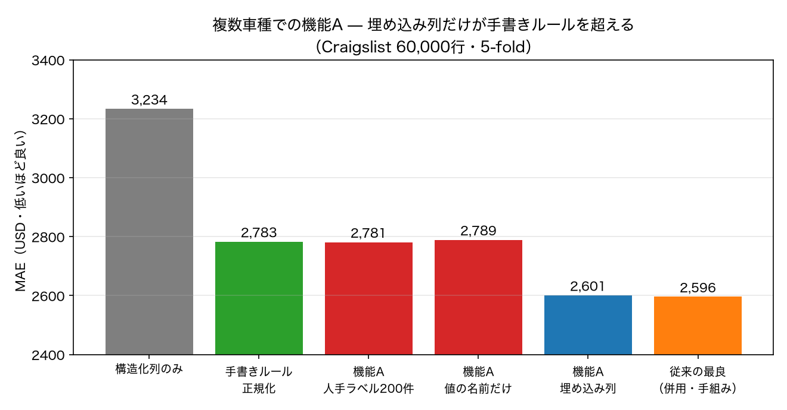

# 機能A を複数車種で測る（P1 の残り）

**日付**: 2026-08-29
**再現**: `.venv/bin/python scripts/demo_feature_vehicles.py` → `.venv/bin/python scripts/plot_feature.py`
**関連**: PRD §8 の P1 / §7-1（教師ラベルの起点）/ §7-3（機能A の評価軸）
**前提**: 単一車種（シエンタ）での測定は `docs/2026-08-29-feature-skeleton.md`

## 何を確かめたかったか

シエンタでの測定で「**値の名前だけを起点にすれば人手ラベル200件より強い**」という
結果が出たが、そのとき**シエンタ固有の可能性がある**と書いた。グレード名がタイトルに
文字どおり書かれているためで、Craigslist の `車種名`（9,611種類の自由記述）では
同じ条件が成り立たない。ここではそれを実際に確かめる。あわせて、
機能A の API を通しても素で書いた特徴量と同じ精度が出るか（実装の健全性）も見る。

条件は既存の測定と完全に同じ（60,000行・5-fold・seed 42・同じ構造化列）。

## 結果

| 手法 | MAE（USD） | 振れ幅 | 既測との対応 |
|---|---:|---:|---|
| A2' 構造化列のみ | 3,233.54 | ±22.06 | 既測 3,234 と一致 |
| B2' ＋車種名を手書きルールで正規化 | 2,782.95 | ±6.95 | 既測 2,783 と一致 |
| F(a)' ＋機能A・人手ラベル200件 | 2,781.36 | ±18.63 | 新規 |
| F(b)' ＋機能A・ラベル0件（値の名前だけ） | 2,789.35 | ±18.97 | 新規 |
| **F(c)' ＋機能A・埋め込み列（既定エンコーダ）** | **2,601.14** | **±3.92** | 新規 |
| F(c-e5)' ＋機能A・埋め込み列（e5-small を API 経由で） | 2,613.86 | ±6.67 | 既測 D1 2,620 に対応 |
| （参考）C2 車種名の文字TF-IDF | 2,640 | — | 既測 |
| （参考）D4 埋め込みと文字TF-IDF の併用（従来の最良） | 2,596 | — | 既測 |

**上2行が既測値をそのまま再現している。**条件が揃っていることの確認であり、
以下の比較はこの土俵の上で読める。



### 1. 機能A の埋め込み列が、従来の最良に並んだ

F(c)' の 2,601 は、文字TF-IDF（2,640）と e5 埋め込み（2,620）を単体で上回り、
**従来の最良である併用（2,596）と実質同着**（差 5、振れ幅 ±3.9〜）。
既定エンコーダは追加依存なしの文字 n-gram TF-IDF を 256 次元に圧縮したもので、
**特徴量を手で組まず、1行の API 呼び出しで到達している**。

```python
df["車種"] = Feature(source="車種名", type="embedding").fit_transform(df)
```

素の文字TF-IDF（2,640）より良いのは、(i) 1,000 の疎な特徴量を 256 の密な次元に
圧縮していること、(ii) 既定の前処理（定数語の除去）が入っていることによる。

F(c-e5)' は既存の e5 埋め込みを `PrecomputedEncoder` 経由で使ったもので、
既測 D1（2,620）との差は 6 USD（振れ幅 ±6.7 の範囲内）。
**API を通しても数字が変わらない**ことの確認になる。

### 2. シエンタで出た「値の名前 > 人手ラベル」は一般化しなかった

| 起点 | シエンタ（単一車種） | Craigslist（複数車種） |
|---|---:|---:|
| 人手ラベル200件 | 16.72 万円 | 2,781.36 USD |
| 値の名前だけ | **14.41 万円** | 2,789.35 USD |
| 手書きルール | 13.60 万円 | 2,782.95 USD |

Craigslist では**3つとも実質同着**（2,781〜2,789、振れ幅 ±19）。
シエンタで見えた 2.31 万円の差は再現しなかった。
**前回「シエンタ固有かもしれない」と書いた但し書きは正しかった。**

理由は宣言できる値の被覆率にある。

| | 宣言した値の数 | カバーできた行 | 真の水準数 |
|---|---:|---:|---:|
| シエンタ | 10 | 88.1% | 116 |
| Craigslist | 60 | **34.5%** | 5,156 |

中間ラベルの精度を見ると事情がはっきりする。ラベル0件の起点は
**宣言値に該当する行では accuracy 1.000**（`f-150 raptor arizona...` から `f-150` を
確実に取り出す）だが、全体では 0.345 にとどまる。**当てられないのではなく、
宣言していない車種は表現できない**のが効いている。

**カテゴリに丸める設計は、水準数が数千を超える自由記述では破綻する。**
値を60個書いても3分の1しか覆えず、600個書いても全部は書けない。
一方 `type="embedding"` は丸めが起きないので 2,601 まで伸びる。

### 3. 信頼度ルーティングは複数車種でも機能する

confidence の低い順に切り捨てたときの accuracy（正解＝手書きルールの正規化結果）。

| LLM に回す割合 | 値の名前だけ | 人手ラベル200件 |
|---:|---:|---:|
| 0% | 0.345 | 0.325 |
| 10% | 0.383 | 0.344 |
| 30% | 0.415 | 0.385 |
| 50% | 0.521 | 0.467 |

シエンタと同じく**単調に上がる**。データセットを変えても confidence は
「当たりやすい行」を見分けており、`AdaptivePredictor` の前提は保たれている。

## 機能A の設計に持ち帰るもの

1. **`type="embedding"` を既定に据えるべき。** 単一車種でも複数車種でも、
   カテゴリに丸めた版より下流の精度が良い（シエンタ 13.97 対 14.41、
   Craigslist 2,601 対 2,789）。仕様書の `Feature(type="category", values=[...])` は
   **人が読める列が必要なときの選択肢**であって、精度目的の既定ではない。
2. **`values=[...]` は水準数が小さいときだけ有効。** 目安として、宣言値で
   8割以上を覆えるかを実行前に警告できるとよい（被覆率は価格を見ずに計算できる）。
3. **人手ラベルの件数は、この題材では効かない。** 200件でも全件でも手書きルールと同着。
   ラベル収集に工数を割く前に、埋め込み列で足りないかを確かめる順序が正しい。
4. 既定エンコーダ（文字 TF-IDF + SVD）は、torch なしで従来の最良に並んだ。
   **埋め込みモデルを必須にしない**という判断は実測で支持されている。

## 残り

- **P2（未知の車種名だけで測り直す）** は未実施。既測では文字TF-IDF 3,715 が
  埋め込み 3,873 に勝っており、機能A の既定エンコーダがどちらに寄るかは別途測る必要がある。
- 埋め込みと文字TF-IDF の併用（従来の最良 2,596）に相当する構成は、機能A の API では
  まだ表現できない（エンコーダを1つしか指定できない）。複数エンコーダの併用は今後の課題。
